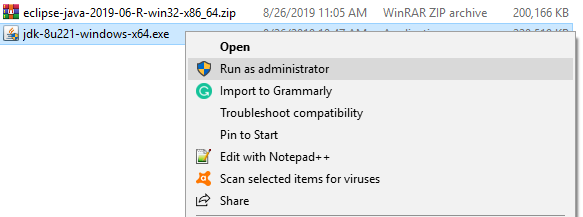

# Java SDK and Eclipse installation
## Java SE Development Kit
### Download software
Go to [Oracle website](https://www.oracle.com/technetwork/java/javase/downloads/jdk8-downloads-2133151.html) to download one Java SDK version for your corresponding operating system:
* Windows x86: jdk-8u221-windows-i586.exe
* Windows x64: jdk-8u221-windows-x64.exe
* Mac OS X or above: jdk-8u221-macosx-x64.dmg
### Installation on Windows
1. Run as administrator and click the following **Next** button until the installation finishes.

1. Config operating system path:
    1. Copy the java jdk path
    
        
    1. Then, paste it to system path variable.
    ![system]!(image/system_path.png)
    
    
    1. Repeat step 1 and 2 for java jre.
    
1. Test: open **Command Prompt** and type `java -version`. 

## Java IDE for Java Developers
### Download software
Download Eclise (Java IDE for Java Developers) for your corresponding operating system:
* [URL for Windows.](https://www.eclipse.org/downloads/download.php?file=/technology/epp/downloads/release/2019-06/R/eclipse-java-2019-06-R-win32-x86_64.zip)
* [URL for Mac OS X or above.](https://www.eclipse.org/downloads/download.php?file=/technology/epp/downloads/release/2019-06/R/eclipse-java-2019-06-R-macosx-cocoa-x86_64.dmg)

